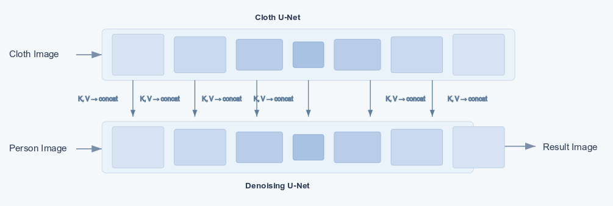

# Virtual try on application

Mutual Self-attention based **Dual U-Net** architecture for virtual try on. Please visit https://vilt.vercel.app to try it out. 

or watch the video here: https://youtu.be/izVLqsLxXvg

 
 

<table>
<td>
 

</td>
<td>
 

</td>
</table>

 
 

# Model Architecture Overview

The system is a **two-stage, dual-U-Net diffusion model**. It is designed to "try on" a garment from a source image (`cloth_image`) onto a target person from another image (`person_image`).

Unlike standard diffusion models that use a single U-Net, this architecture employs two distinct U-Nets:

1. `Cloth U-Net:` Its sole purpose is to process the garment image and extract its key visual features (like texture, pattern, and color).

2. `Denoising U-Net:` This is the main image generator. It builds the new image of the person wearing the garment by progressively denoising a random latent. It is guided by two sources: the encoded person image and the features from the Reference U-Net.

 

 
Fig: Mutual Self-Attention Mechanism of Cloth and Person U-Net models.

These two U-Nets are coupled to inject the garment's features into the denoising process using mutual self-attention.

## 🔑 Key Mechanism (`Mutual Self-Attention`)

Intercepting the self-attention blocks of both U-Nets to pass information. This operation is done in two steps:

**Collecting Cloth Features:** When the `cloth_unet` performs its single forward pass on the `cloth_image_latent`, this controller activates. At each transformer block, the controller intercepts the input features to the attention layer. After the complete pass, it contains a multi-scale "fingerprint" of the garment, capturing its features at all levels of the U-Net.

**Injecting Cloth Feature:** Before the denoising loop begins, the system hand over all the cloth feature to the denoising U-Net. During the denoising loop, as the `Denoising U-Net` processes its own latents (representing the person), its modified self-attention blocks (`BasicTransformerBlock_Denoising`) execute the following:
1.  The block's **Query (Q)** is computed from its own hidden states (the person features).
2.  The block retrieves the corresponding garment features for that layer.
3.  It constructs a new **Key (K)** and **Value (V)** by **concatenating** its *own* hidden states with the *garment features* for that layer.
4.  The attention mechanism then computes: `Attention(Q_person, K_[person+garment], V_[person+garment])`.

This `Mutual Self-Attention` forces the denoising network (while generating the person) to look up and pull relevant visual information from the garment features at every layer, effectively "draping" the garment's texture and style onto the generated person's shape.

## Core Components

* **VAE:** A standard Variational Autoencoder used to embed images.

* **Cloth U-Net:** Its sole purpose is to process the VAE-encoded garment latent and extract a set of multi-scale visual features (texture, pattern, color, etc.).

* **Denoising U-Net:** This is the primary generator U-Net. It synthesizes the final image by progressively denoising a random latent. Its operation is guided by two `person image latent`  and the features injected from the Cloth U-Net.
